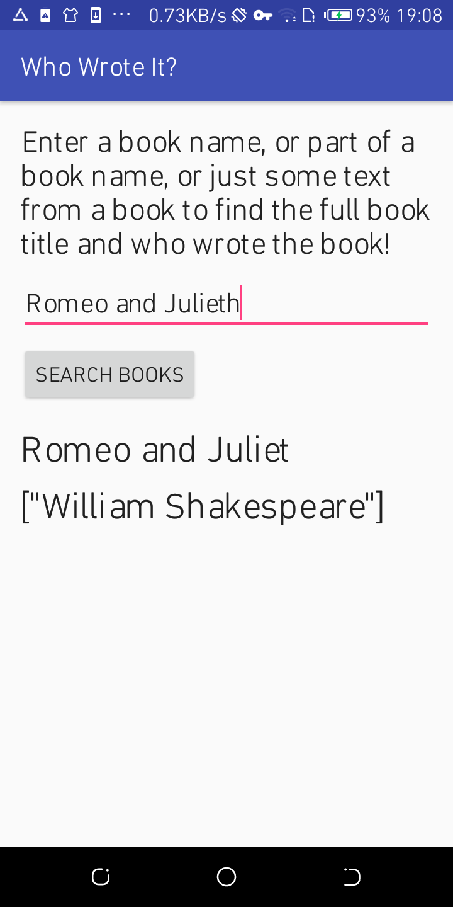

# Codelabs Exercises

# Week 2: Get Started

## Exercise 1.1

This is getting started with android in android studio

# Week 3: Layouts and resources for the UI

## Exercise 1.2

### Part A

Added count and toast functionality on App.

### Part B

Added orientation functionality to App.

# Week 4: Activities and intents

## Exercise 2

Added intent functionality with putExtra/getExtra features on App.

# Week 5: Implicit Intents

## Exercise 3

Added intent functionality with ability to start other Apps which supports certain type of data.

# Week 6: User Interaction

## Exercise 4

Added clickable image functionality.
4.1

4.2

# Week 7: User Interaction

## Exercise 5

Added user navigation.
4.4

Added recyclerview.
4.5

# Week 8: Material Design

## Exercise 6

Cards and Colors
5.2

# Week 9: Background Tasks

## Exercise 7

AsyncTask and AsyncTaskLoader(Emulator)
7.2

AsyncTask and AsyncTaskLoader(Real device)
7.2

# Week 10: Notifications

## Exercise 8

Notifications
8.1

# Week 11: Shared Preferences

## Exercise 9

Shared Preferences
9.1

