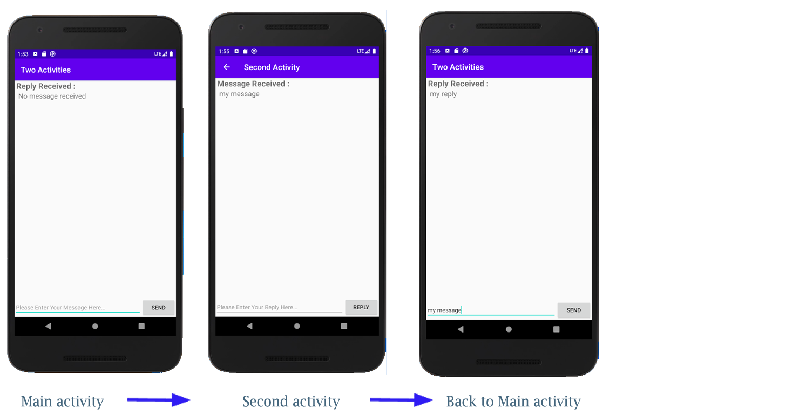

# Codelabs Exercises
## Exercise 1.1
This is getting started with android in android studio

## Exercise 1.2
### Part A
Added count and toast functionality on App.

### Part B
Added orientation functionality to App.

## Exercise 2
Added intent functionality with putExtra/getExtra features on App.

## Exercise 3
Added intent functionality with ability to start other Apps which supports certain type of data.

## Exercise 4
Added clickable image functionality.
4.1

4.2

## Exercise 5
Added user navigation.
4.4

Added recyclerview.
4.5

## Exercise 6
Cards and Colors
5.2

## Exercise 7
AsyncTask and AsyncTaskLoader
7.2

## Exercise 8
Notifications
8.1

